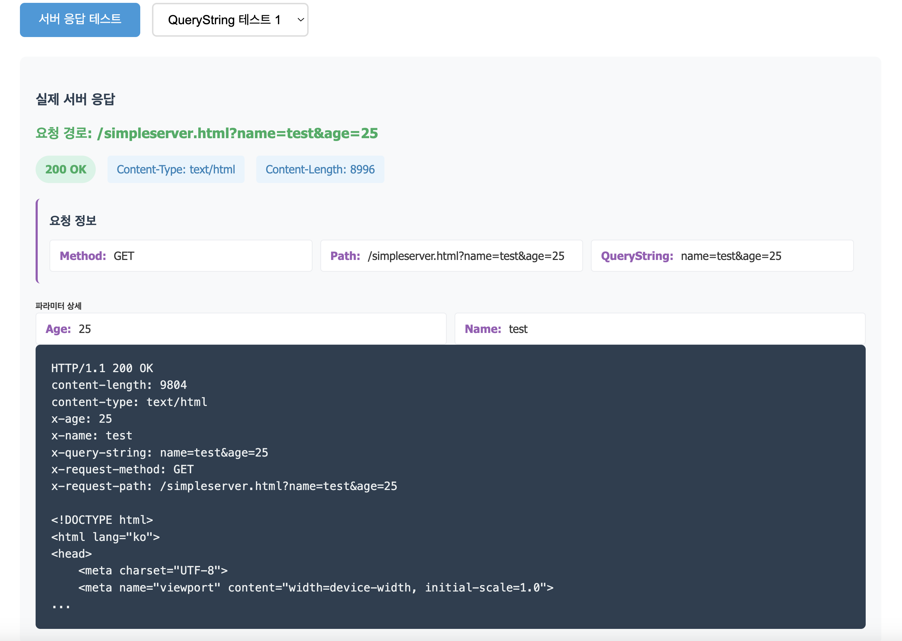

# Simple HTTP Server 구현 - 1단계

## 🎯 목적

- 서버의 기본 구조와 동작원리 이해
- `ServerSocket`을 사용한 서버 시작 및 클라이언트 연결 처리
- HTTP 요청 파싱(GET 지원)
- 간단한 정적 파일 서비스 (HTML, JS, CSS) 구현
- HTTP 상태 코드 반환 (200 OK, 404 Not Found)
- 기본적인 QueryString 파싱 및 파라미터 추출

## 🚀 구현된 기능

### 1. **서버 기본 구조**
- `ServerSocket`을 사용한 8080 포트 바인딩
- 무한 루프로 클라이언트 연결 대기
- try-with-resources를 사용한 자원 관리

### 2. **HTTP 요청 처리**
- HTTP 요청 라인 파싱 (`GET /path HTTP/1.1`)
- 메서드와 경로 추출
- 기본 라우팅 (루트 경로 → index.html)

### 3. **정적 파일 서비스**
- `public` 폴더의 파일들을 HTTP 응답으로 제공
- 파일 확장자별 MIME 타입 자동 설정
- 파일을 찾을 수 없는 경우 404 응답

### 4. **QueryString 파싱**
- URL 파라미터 추출 (`?key=value&key2=value2`)
- 키-값 쌍으로 분리하여 처리
- 서버 콘솔에 파싱 결과 로그 출력

### 5. **HTTP 응답 생성**
- 상태 코드 (200 OK, 404 Not Found)
- Content-Type 헤더 자동 설정
- Content-Length 헤더 계산
- 응답 본문 전송

## 📁 프로젝트 구조

```
src/main/java/com/example/springlm/step1/simplehttpserver/
├── SimpleHttpServer.java          # 메인 서버 클래스
└── server-step1.md               # 구현 가이드 문서

public/
├── simpleserver.html             # 웹 테스트 인터페이스
├── style.css                     # 스타일시트
└── script.js                     # 클라이언트 사이드 로직
```

## 🛠️ 핵심 코드 분석

### 서버 시작
```java
ServerSocket serverSocket = new ServerSocket(8080);
```
- 서버 시작(클라이언트 연결 요청을 받을 준비)
- 포트 바인딩
- 네트워크 리스닝(8080 포트에서 들어오는 연결 요청을 대기)

### 문자 처리
```java
try (Socket clientSocket = serverSocket.accept();
     BufferedReader in = new BufferedReader(new InputStreamReader(clientSocket.getInputStream()));
     OutputStream out = clientSocket.getOutputStream()) {
```
- 버퍼링으로 I/O 작업의 효율성 높임
- 소켓에서 응답을 받으면 clientSocket으로부터 입력 스트림을 얻고, raw 바이트 데이터 → InputStream 객체로 변환
- InputStream(바이트 스트림)을 Reader(문자 스트림)로 변환
- 문자 입력 스트림에 버퍼링 기능을 추가

### HTTP 요청 파싱
```java
String requestLine = in.readLine();
if (requestLine == null) continue;

String[] requestParts = requestLine.split(" ");
if (requestParts.length != 3) continue;

String method = requestParts[0];
String path = requestParts[1];
```
- 입력 스트림에서 한 줄씩 텍스트를 읽음
- requestLine이 null(입력 스트림의 끝)이라면, continue 문을 실행
- requestLine(HTTP 요청의 첫 줄)을 공백(" ")을 기준으로 분할하여 문자열 배열 requestParts에 저장
- 분할된 요청 부분이 정확히 3개가 아니면 현재 반복을 중단하고 다음 반복으로 넘어감
- requestParts 배열의 첫 번째 요소를 method 변수에 저장
- requestParts 배열의 두 번째 요소를 path 변수에 저장

### QueryString 파싱
```java
// QueryString 파싱
String queryString = null;
String originalPath = path; // 원본 경로 보존

if (path.contains("?")) {
    String[] pathAndQuery = path.split("\\?", 2);
    path = pathAndQuery[0];           // 파일 경로 (QueryString 제거)
    queryString = pathAndQuery[1];    // QueryString 부분
    
    // 파라미터 파싱 및 로그 출력
    String[] params = queryString.split("&");
    for (String param : params) {
        if (param.contains("=")) {
            String[] keyValue = param.split("=", 2);
            String key = keyValue[0];
            String value = keyValue.length > 1 ? keyValue[1] : "";
            System.out.println("  " + key + " = " + value);
        }
    }
}
```

## 🚀 실행 방법

### 1. **IDE에서 실행**
- IntelliJ IDEA: Run > Edit Configurations > Application
- Main class: `com.example.springlm.step1.simplehttpserver.SimpleHttpServer`
- Module: 해당 프로젝트 모듈 선택

### 2. **명령줄에서 실행**
```bash
# 프로젝트 루트 디렉토리에서
java -cp src/main/java com.example.springlm.step1.simplehttpserver.SimpleHttpServer
```

### 3. **브라우저에서 테스트**
```
http://localhost:8080/simpleserver.html
```

## 🔧 테스트 기능

### 웹 인터페이스
- 다양한 경로로 HTTP 요청 테스트
- QueryString 파라미터 테스트
- 실제 서버 응답 확인
- 응답 헤더 및 본문 표시

### 테스트 예시




## 📊 성능 및 한계

### 현재 구현의 한계
- 단일 스레드로 동시 요청 처리 불가
- 기본적인 기능만 제공하며, 성능 최적화 미흡
- 보안 기능 부족 (SQL 인젝션, XSS, CSRF 등)
- 고급 기능 미구현 (로드 밸런싱, SSL/TLS, 캐싱 등)

### 개선 방향
- 멀티스레드 처리 구현
- 보안 기능 추가
- 성능 최적화
- 로깅 및 모니터링 기능
